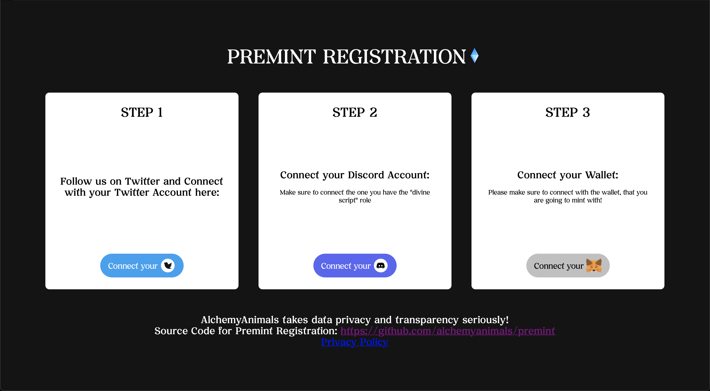

# 1. General Information

This is the unchanged and unfiltered code for the site https://alchemyanimals.art/premint with backend located at https://alchemyanimals.art/backend.

We at Alchemy Animals value Data Privacy and Code Transparency over all. That's why we decided to completely release the source code used for Premint Registration to github.

Using MIT License means you are allowed to check, modify and reuse our code for your project! We only ask you to kindly refer back to this repository so that it can be maintained and improved.

If there are any improvements or issues please submit a pull request/issue [in this repository.](https://github.com/alchemyanimals/premint)

-----

## Why use a premint solution?

The start of the presale mint era required that developers all over the NFT and Crypto ecosystem need to get a list of wallets that are allowed to use that functionality to mint (buy/obtain) tokens.

This list is then usually used to generate a merkle tree for easy, gas efficient verification in the smart contract.

How can developers get the wallet addresses and verify they should be allowed to access presale?

1) Manually ask everyone. can be thousands of people.. meh
2) Let everyone register themselves in a sheet or discord? need to copy messages ... meh
3) Public Document? so you have a CSV? .. verfication .. meh
4) Using a presale flow that checks Discord Roles and if wanted Twitter Account following the project which guarantees uniqueness and provides a database with all wallet addresses? YES ser!

This is why we built AlchemyAnimals Premint! Due to this requirement. Anyone can simply register and we know it's valid. Database can then be exported to csv or used in any way necessary to build the merkle tree.



# 2. OAuth2 Flow for Discord and Twitter

We use the official OAuth2 Flow of Discord and Twitter, Documentations can be found here: 

## 2.1 Discord
Discord OAuth2 Documentation:
https://discord.com/developers/docs/topics/oauth2

Our Implementation:
/backend/premint/set_discord.php

### 2.1.1 Discord OAuth2 Permissions/Scope

As can be seen in the following line of code

```
'scope' => 'identify guilds.members.read'
```
/backend/premint/set_discord.php Line:23

we use the scope identify and guilds.members.read for discord oauth2.

These two scopes are absolutely needed to collect the following 2 pieces of information for each user:

1. Discord Username of user
2. Discord Roles of user ONLY on discord.gg/alchemyanimals

## 2.2 Twitter

Twitter OAuth2 Documentation:
https://developer.twitter.com/en/docs/authentication/oauth-2-0/authorization-code

Our Implementation: 
/backend/premint/set_twitter.php

### 2.2.1 Twitter OAuth2 Permissions/Scope

As can be seen in the following line of code

```
'scope' => 'follows.read users.read tweet.read'
```
/backend/premint/set_twitter.php Line:28

we use the scopes follows.read users.read tweet.read for OAuth2.

#### WHY THIS MANY PERMISSIONS?

In order for the Twitter API to request the Endpoint /users/:id/followers (EVEN if it's for our own @AlchemyAnimals Twitter Account), the API needs all three of these scope parameters.

See official OAuth2 Docs (Under Chapter OAuth 2.0 scopes required by this endpoint):

https://developer.twitter.com/en/docs/twitter-api/users/follows/api-reference/get-users-id-followers

# 3. What Data do we save?

```
  $record->Discord = $discord;
  $record->Twitter = 'complete';
  $record->Wallet = $wallet;
  $DB->insert_record('premint', $record);
```
/backend/premint/get_session.php

We only save the two following important values, no information in regards to your twitter account is stored!

## 3.1 Your Wallet ID

We save the wallet ID to our database, because at mint we need to know all the wallets, which are able to buy a token.

## 3.2 Your Discord Username

We save the discord username, so that at mint we can verify AGAIN, that the user indeed has The Divine role in our discord.


# 4. Wallet Connect

Wallet Connect on our website is being provided by NoahZinsmeister's brilliant library Web3React:
https://github.com/NoahZinsmeister/web3-react

Please read up on it's privacy policy.


###

